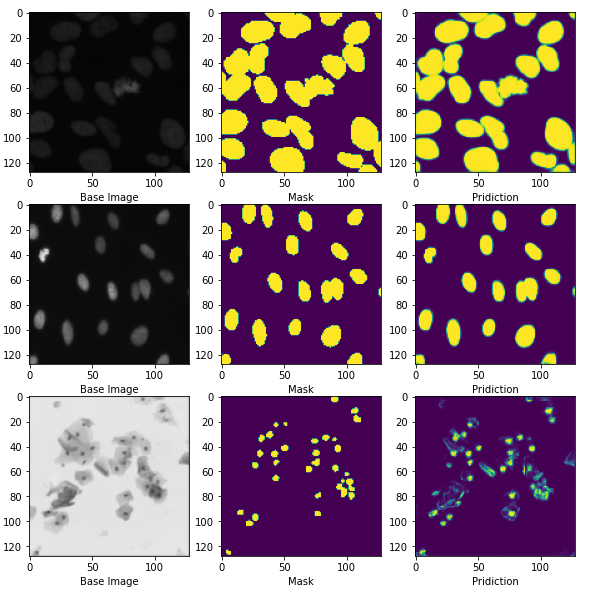

# Modified-Double-U-Net-Architecture-for-Medical-Image-Segmentation
## This repository contains code for the paper entitled "Modified Double U-Net Architecture for Medical Image Segmentation" published at IEEE Transactions on Radiation and Plasma Medical Sciences and the same can be obtained from [here](https://ieeexplore.ieee.org/abstract/document/9946418).

# Abstract 

Semantic segmentation is the process of labelling each pixel of an input image with its appropriate class. In biomedical image processing, semantic segmentation is a critical pre-processing step. After the evolution of deep learning, specifically, the U-Net, which is based on the encoder-decoder model, researchers have extensively used several modified versions of U-Net for semantic segmentation. This manuscript presents a novel architecture called modified Double U-Net for various biomedical image segmentation tasks. The modified Double U-Net takes full advantage of Double U-Net and ensemble learning. It is the combination of two U-Net architectures stacked on top of each other. The first U-Net uses an ensemble of pre-trained Xception, DenseNet, and VGG-19. We have deliberately used a pre-trained model so that the features learnt from the ImageNet classification task can be reused for our semantic segmentation task. Another U-Net is stacked at the bottom to capture more information that can be used in our semantic segmentation task.
The performance of our proposed model has been evaluated on five different medical datasets, namely the Data Science Bowl Challenge-2018, the CVC-ClinicDB dataset, which has complex images such as smaller and flat polyps, the ISIC-2018 challenge dataset, the Kvasir-Instrument dataset, and the INBreast dataset achieving state-of-the-art performance. Conducting five-fold cross-validation on the five datasets mentioned above IoU of 89.13 ± 2.88, 85.22 ± 1.26, 83.13 ± 3.56, 85.22 ± 1.26, and 95.22 ± 2.56 were obtained.

# Model description 

As the name suggests, the modified double U-Net consists of two U-Nets stacked over each other. As shown in figure below,

  
<em>Figure 1: Illustration  of  the proposed model </em>
   

the modified Double U-Net begins with network1 or the first U-Net, which is built with an ensemble of VGG-19, Xception Net, and DenseNet121. The ensemble of three different pre-trained networks act as an encoder1. The output1 is collected from the end of the network1 and is multiplied with the original input before passing it to the second network or the second U-Net. It is expected that the output created at the end of the network1 may be enhanced further by retrieving the input image and its related mask once again and concatenating it with Output2. It will result in a better segmentation mask than the previous one.The squeeze-and-excite block is used in network 1's encoder and network 2's encoder and decoder to eliminate unnecessary information and pass only the important ones and ASPP (Atrous Spatial Pyramid Pooling) has been a popular choice for modern segmentation architecture because it helps to extract high-resolution feature maps that lead to superior performance.

# Results

The performance of our proposed model has been evaluated on five different medical datasets, namely the Data Science Bowl Challenge-2018, the CVC-ClinicDB dataset, which has complex images such as smaller and flat polyps, the ISIC-2018 challenge dataset, the Kvasir-Instrument dataset, and the INBreast dataset achieving state-of-the-art performance. Conducting five-fold cross-validation on the five datasets mentioned above IoU of 89.13 ± 2.88, 85.22 ± 1.26, 83.13 ± 3.56, 85.22 ± 1.26, and 95.22 ± 2.56 were obtained. Segmentation on few sample images from each and every five datasets are shown below. The images shown are in chronogical order.

1. Data Science Bowl Challenge-2018, 

2. CVC-ClinicDB dataset 

3.ISIC-2018 challenge dataset 

4.Kvasir-Instrument dataset 

5.INBreast dataset

  
<em>Figure 2: Results on Data Science Bowl Challenge-2018 </em>
   

  
<em>Figure 3: Results on CVC-ClinicDB dataset  </em>
   

  
<em>Figure 4: ISIC-2018 challenge dataset  </em>
   

  
<em>Figure 5: Few segmentation results shown on Kvasir-Instrument dataset  </em>
   

   

  
<em>Figure 6: Few results shown on INBreast dataset  </em>
   

## For more details please refer to the original paper.

# Code explanation

The initial experiments were conducted on Data Science Bowl Challenge Dataset (DSB) and the details about the same are given in the table above. DSB dataset is selected as the size of the images here is 128 X 128 X 3. It is the minimum among all the five datasets used and thus requires minimum training and testing time. All the experiments were conducted on Google Colaboratory. The .ipynb code attached contains experiments conducted on the same dataset. It also conatins comparison with U-Net, BCDU-Net, and various kinds of Double U-Net. Details about the same are given in the Appendix section of the original paper. 

# The above paper was also accepted for poster presentation at Graduate Students' Day event that was held at the sidelines of National Conference on Communications 2023. More details about the event can be found [here](https://event.iitg.ac.in/ncc2023/gsd.php).  

 

## Citation
Please cite our paper if you find the work useful: 
<pre>
@article{deb2022modified,
  title={Modified Double U-Net Architecture for Medical Image Segmentation},
  author={Deb, Sagar Deep and Jha, Rajib Kumar},
  journal={IEEE Transactions on Radiation and Plasma Medical Sciences},
  year={2022},
  publisher={IEEE}
}
</pre>
